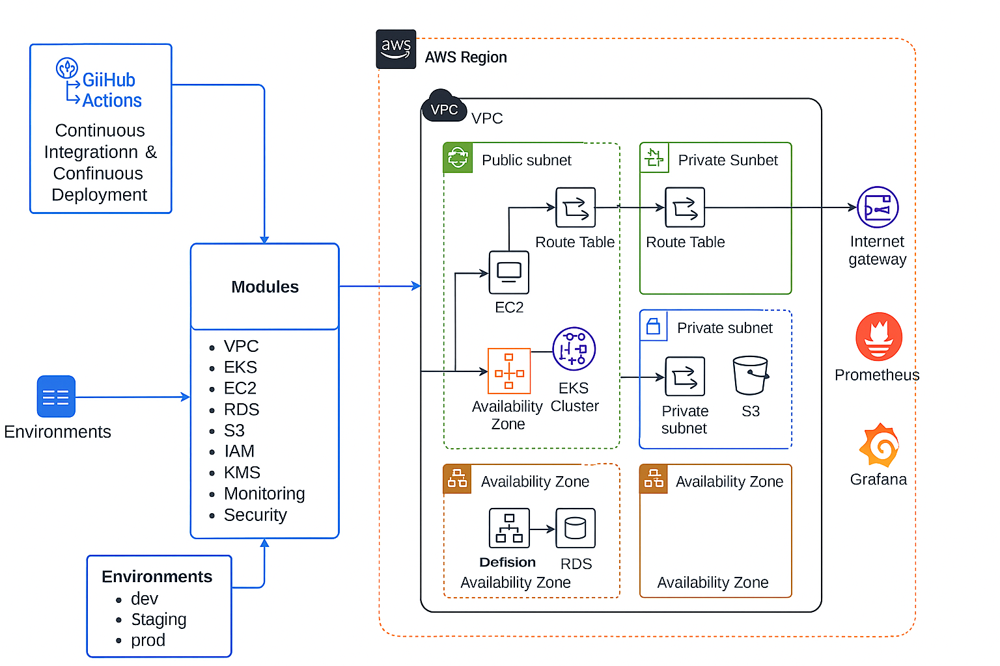

# 🚨 Problem Statement 
**_[Current Project Mike is working on ~ Interview use case]_**

A FinOps-focused client managing multiple financial applications on AWS requires a robust, scalable, and secure infrastructure automation framework. Manual provisioning was error-prone, inconsistent, and slow. The client needs reusable Terraform modules for backend and frontend application deployment, alongside a defined security posture including IAM hardening, VPC controls, and guardrails.
The client lacks automated, reusable infrastructure modules and a secure cloud posture for deploying both frontend (Kubernetes) and backend (EC2) workloads on AWS. Manual provisioning and inconsistent environments are leading to cost inefficiencies and security risks.

- This repo is maintained by [Devops with Mike](https://www.youtube.com/@DevOpsWithMike0)
- For interview preparation, use this platform [Wandaprep](http://www.wandaprep.com/)

## ✅ Deliverables

1. Build reusable Terraform modules for AWS infrastructure (EKS, EC2, RDS, S3, IAM, etc.).

2. Implement secure deployment pipelines using CI/CD.

3. Set up logging, monitoring, and alerting.

4. Define and enforce security posture using AWS best practices.

5. Document all implementation, runbooks, and architecture in Confluence.

6. Provide demo environments (dev/staging) to validate deployments.


## 🗂️ Project Timeline (Scrum Sprints Overview - 5 Sprints)

| Sprint    | Goal                          |
|-----------|-------------------------------------|
| Sprint 1  | Discovery & Environment Setup (Jira & Confluence structure, Initial module scaffolding)      |
| Sprint 2  | Terraform Modules - Backend         |
| Sprint 3  | CI/CD Integration & Testing         |
| Sprint 4  | Security postured automation (IAM, SGs, KMS), Monitoring & Logging       |
| Sprint 5  | Final documentation, Testing, UAT, Handover |
---

## 📌 JIRA Breakdown (Use these as Epics, Stories, Tasks, and Sub-tasks)

### 🔷 Epic 1: Project Initialization & Discovery
#### 🟡 Story: Setup Jira and Confluence for Project
**Task:** Create a dedicated Scrum board in Jira for the project.
* **Task:** Define and create initial epics in Jira to broadly categorize the project's work (e.g., Infrastructure, CI/CD, Security, Monitoring).
* **Task:** Plan and create the first few sprints in Jira, assigning initial stories and tasks.
* **Task:** Set up a dedicated Confluence space for project documentation, including meeting notes, design decisions, and architecture diagrams.
* **Task:** Establish page hierarchies and naming conventions within the Confluence space for easy navigation.

#### 🟡 Story: Access & Pre-req Validation
* **Task:** Request and provision dedicated AWS accounts for development and staging environments, ensuring proper isolation.
* **Task:** Validate user permissions within the provisioned AWS accounts to ensure necessary access for Terraform deployments and resource management.
* **Task:** Document the required AWS CLI and Terraform versions for the project.
* **Task:** Ensure all team members have the necessary credentials and have configured their local environments to access the AWS accounts.
* **Task:** Verify network connectivity to the AWS accounts from the development machines.


### 🔷 Epic 2: Terraform Module Development
#### 🟡 Story: Create Terraform module for VPC
* **Task:** Define the required inputs for the VPC module, including CIDR blocks for the VPC and subnets, availability zones, and tags.
* **Task:** Define the outputs of the VPC module, such as VPC ID, subnet IDs, route table IDs, Internet Gateway ID, and NAT Gateway IDs (if applicable).
* **Task:** Write the reusable Terraform module for creating the VPC resource, including subnets (public and private), route tables, Internet Gateway, and NAT Gateways (considering high availability).
* **Task:** Implement resource tagging within the VPC module for cost tracking and management.
* **Task:** Test the VPC module using `terraform plan` and `terraform apply` in the development AWS account with various input configurations.
    * **Sub-task:** Unit test the VPC module to ensure it creates the expected resources with the correct configurations.
    * **Sub-task:** Write a README for the VPC module with clear usage examples, input descriptions, and output explanations.

#### 🟡 Story: Create module for EKS
* **Task:** Define the inputs for the EKS module, including cluster name, VPC ID, subnet IDs, node group configurations (instance types, desired capacity, etc.), and Kubernetes version.
* **Task:** Define the outputs of the EKS module, such as cluster endpoint, kubeconfig, and node group names.
* **Task:** Write the Terraform module to create the EKS cluster and associated node groups.
* **Task:** Integrate the EKS module with the previously created VPC module to ensure the cluster is deployed within the defined network.
* **Task:** Integrate the EKS module with the IAM Roles module to assign necessary permissions to the EKS nodes and control plane.
* **Task:** Set up initial node groups with appropriate instance types and scaling configurations.
* **Task:** Configure basic config maps and secrets required for initial EKS setup.
* **Task:** Test the EKS module using `terraform plan` and `terraform apply` in the development AWS account.
    * **Sub-task:** Unit test the EKS module to verify the cluster and node groups are created correctly and integrated with the VPC and IAM roles.
    * **Sub-task:** Write a README for the EKS module detailing its usage, required inputs, and expected outputs.

#### 🟡 Story: Create module for EC2 + Backend
* **Task:** Define the inputs for the EC2 module, including instance type, AMI ID, subnet ID, security groups, key pair name, and user data.
* **Task:** Define the outputs of the EC2 module, such as instance IDs and public/private IPs.
* **Task:** Write the Terraform module to create EC2 instances for the backend application.
* **Task:** Configure security groups within the module to allow necessary inbound and outbound traffic.
* **Task:** Implement options for attaching EBS volumes and configuring instance profiles.
* **Task:** Test the EC2 module using `terraform plan` and `terraform apply` in the development AWS account.
    * **Sub-task:** Unit test the EC2 module to ensure instances are launched with the specified configurations and security groups.
    * **Sub-task:** Write a README for the EC2 module with usage examples and input/output details.

#### 🟡 Story: Create RDS + S3 modules
* **Task:** Define the inputs for the RDS (Postgres) module, including database engine, instance class, allocated storage, username, password, VPC security group IDs, and subnet group name.
* **Task:** Define the outputs of the RDS module, such as database endpoint, port, and database name.
* **Task:** Write the Terraform module to create a PostgreSQL RDS instance.
* **Task:** Define the inputs for the S3 module, including bucket name, ACL, and versioning configuration.
* **Task:** Define the outputs of the S3 module, such as bucket ARN and bucket name.
* **Task:** Write the Terraform module to create an S3 bucket with the specified configurations.
* **Task:** Test both the RDS and S3 modules using `terraform plan` and `terraform apply` in the development AWS account.
    * **Sub-task:** Unit test the RDS module to verify the database instance is created with the correct parameters.
    * **Sub-task:** Unit test the S3 module to ensure the bucket is created with the specified ACL and versioning.
    * **Sub-task:** Write READMEs for both the RDS and S3 modules with clear usage instructions and input/output details.

#### 🟡 Story: Manage module versions in GitHub
* **Task:** Create a dedicated GitHub repository for storing the Terraform modules.
* **Task:** Implement a versioning strategy for the modules (e.g., semantic versioning).
* **Task:** Utilize Git tags to mark specific module versions.
* **Task:** Document the process for updating and releasing new module versions.
* **Task:** Explore using Terraform Registry or a private module registry for module distribution.


### 🔷 Epic 3: CI/CD Pipeline Integration
#### 🟡 Story: Configure GitHub Actions for Terraform plan/apply
* **Task:** Create GitHub Actions workflows to automatically run `terraform plan` on pull requests targeting the main branch.
* **Task:** Configure a separate workflow to run `terraform apply` upon merging pull requests to the main branch, potentially requiring manual approval.
* **Task:** Store Terraform state securely in an S3 bucket with DynamoDB locking.
* **Task:** Ensure the GitHub Actions workflows have the necessary AWS credentials to interact with the target accounts.
* **Task:** Implement secret management within GitHub Actions for sensitive data.

#### 🟡 Story: Configure workflows for dev/staging environments
* **Task:** Create separate GitHub Actions workflows or modify existing ones to target the development and staging AWS accounts.
* **Task:** Utilize different Terraform state files for each environment.
* **Task:** Implement environment-specific variable files or input configurations.
* **Task:** Potentially implement a workflow to promote changes from development to staging.

#### 🟡 Story: Setup pull request checks and manual approvals
* **Task:** Configure GitHub Actions to automatically run linters and formatters (e.g., `terraform fmt`, `terraform validate`) on pull requests.
* **Task:** Implement static code analysis tools for Terraform (e.g., `tflint`).
* **Task:** Enforce code review for all pull requests before merging.
* **Task:** Configure manual approval steps in the `terraform apply` workflows for both development and staging environments to ensure human oversight.

### 🔷 Epic 4: Security Posture Implementation

#### 🟡 Story: IAM roles, policies & boundary setup
* **Task:** Define the principle of least privilege for all infrastructure components.
* **Task:** Create dedicated IAM roles for ECS tasks and RDS instances with only the necessary permissions.
* **Task:** Implement IAM policies that grant specific actions on required resources.
* **Task:** Explore and implement IAM permission boundaries to further restrict the maximum permissions that a role can assume.
* **Task:** Regularly review and update IAM policies as needed.

#### 🟡 Story: Encrypt resources with KMS
* **Task:** Identify AWS resources that require encryption at rest (e.g., EBS volumes, RDS instances, S3 buckets).
* **Task:** Create and manage KMS keys for encrypting these resources.
* **Task:** Configure Terraform modules to utilize KMS encryption for applicable resources.
* **Task:** Ensure proper key policies are in place to control access to the KMS keys.

#### 🟡 Story: Enforce tagging for FinOps
* **Task:** Define a consistent tagging strategy for all AWS resources, including tags for cost center, environment, application, and owner.
* **Task:** Implement Terraform configurations within the modules to enforce the application of required tags.
* **Task:** Utilize AWS Cost Explorer and Cost and Usage Reports to analyze costs based on the defined tags.
* **Task:** Regularly audit resource tagging and remediate any inconsistencies.

#### 🟡 Story: Use AWS Config / Trusted Advisor for checks
* **Task:** Enable and configure AWS Config to track resource configurations and compliance.
* **Task:** Define Config rules to monitor for specific security and compliance requirements.
* **Task:** Regularly review findings from AWS Config and remediate non-compliant resources.
* **Task:** Utilize AWS Trusted Advisor to identify potential security vulnerabilities, cost optimization opportunities, and performance improvements.
* **Task:** Implement automated responses to certain Config rule violations where appropriate.

### 🔷 Epic 5: Monitoring and Logging

#### 🟡 Story: Setup CloudWatch and Prometheus
* **Task:** Configure CloudWatch alarms for key metrics of the deployed infrastructure (e.g., CPU utilization, memory usage, network traffic, database connections).
* **Task:** Define appropriate thresholds and notification mechanisms for the CloudWatch alarms.
* **Task:** Deploy and configure Prometheus within the EKS cluster or on EC2 instances to collect application-level metrics.
* **Task:** Expose Prometheus metrics in a format that can be scraped by a monitoring system.
* **Task:** Integrate Prometheus with a persistent storage solution.

#### 🟡 Story: Integrate Grafana Dashboards
* **Task:** Deploy and configure Grafana to visualize metrics collected by CloudWatch and Prometheus.
* **Task:** Create informative Grafana dashboards for different infrastructure components (VPC, EKS, RDS, EC2) and applications.
* **Task:** Customize dashboards with relevant graphs, tables, and alerts.
* **Task:** Secure access to the Grafana instance.

#### 🟡 Story: Set alerts for resource threshold breaches
* **Task:** Configure alerting rules in CloudWatch and Grafana to notify relevant teams when resource utilization exceeds predefined thresholds.
* **Task:** Implement different severity levels for alerts.
* **Task:** Integrate alerts with notification channels (e.g., Slack, email).
* **Task:** Regularly review and tune alert thresholds to minimize false positives and ensure timely notifications.

### 🔷 Epic 6: Testing and Handover

#### 🟡 Story: Environment validation (dev/staging)
* **Task:** Perform thorough testing of the deployed infrastructure in both the development and staging environments.
* **Task:** Validate the functionality and performance of the backend application.
* **Task:** Conduct integration tests between different infrastructure components.
* **Task:** Verify the security posture and compliance based on implemented controls.
* **Task:** Document the testing procedures and results.

#### 🟡 Story: Terraform plan review sessions
* **Task:** Conduct regular review sessions of Terraform plans before applying changes to the staging and production (if applicable later) environments.
* **Task:** Involve relevant team members (developers, security, operations) in the review process.
* **Task:** Document the outcome of the plan review sessions.

#### 🟡 Story: Client UAT and documentation walkthrough
* **Task:** Prepare user acceptance testing (UAT) documentation for the client.
* **Task:** Facilitate client UAT sessions in the staging environment.
* **Task:** Address any feedback or issues identified during UAT.
* **Task:** Conduct a walkthrough of the project documentation (architecture diagrams, module READMEs, operational procedures) with the client.

#### 🟡 Story: Handover + Knowledge transfer
* **Task:** Finalize all project documentation and ensure it is easily accessible to the client and any ongoing support teams.
* **Task:** Conduct knowledge transfer sessions with the client's technical team, covering the infrastructure architecture, Terraform modules, CI/CD pipeline, monitoring setup, and operational procedures.
* **Task:** Provide contact information for ongoing support and maintenance.
* **Task:** Obtain formal sign-off from the client upon successful handover.

## 🌱 Solution Architecture

Here is a high level proposed architecture blue print for the complete remediation solution:


## 🌱 GitHub Project Branching Strategy
 
 Your github repo for the project should have this structure:

```
main            # Production-ready code
dev             # Integration branch for tested features
feature/*       # Individual feature work (e.g., feature/eks-frontend)
bugfix/*        # Bug-specific branches
hotfix/*        # Critical patches to production
release/*       # Pre-release staging

```

* Feature Branches → Merged into env branch

* Environment Branches → Merged into main for production release

* PRs require terraform plan to pass before merge

For all the environment, it should look like this

```
main
│
├── dev
│   └── feature/dev-setup-vpc
│   └── feature/dev-monitoring
│
├── staging
│   └── feature/staging-rds
│
└── prod
    └── hotfix/prod-rds-patch
```


## 🗂️ Terraform Project Directory Structure
 
Here is an architectural layout of the infra to be deployed on Amazon Web Service cloud

 

 Your code base should have this structure. The project emphasizes reusable modules for frontend (EKS) and backend (EC2) application deployments on AWS, with a focus on automation and security. 

``` 
terraform-infra/
├── environments/
│   ├── dev/
│   │   ├── backend.tf
│   │   ├── main.tf
│   │   ├── outputs.tf
│   │   ├── providers.tf
│   │   └── terraform.tfvars
│   ├── staging/
│   └── prod/
│
├── modules/
│   ├── vpc/
│   │   ├── main.tf
│   │   ├── outputs.tf
│   │   ├── variables.tf
│   │   └── README.md
│   ├── eks/
│   │   ├── main.tf
│   │   ├── outputs.tf
│   │   ├── variables.tf
│   │   └── README.md
│   ├── ec2/
│   ├── rds/
│   ├── s3/
│   ├── iam/
│   ├── kms/
│   ├── monitoring/
│   │   ├── prometheus.tf
│   │   ├── grafana.tf
│   └── security/
│       ├── aws_config.tf
│       ├── security_group.tf
│       └── config_rules.tf
│
├── shared/
│   └── providers.tf
│
├── scripts/
│   ├── bootstrap.sh
│   ├── deploy.sh
│   └── destroy.sh
│
├── .gitignore
├── README.md
└── terragrunt.hcl (optional)
```
---

## 🔧 CI/CD Folder Structure (Optional)
You can define a clean `ci-cd` folder layout:

```
.github/
 └── workflows/
      └── terraform.yml
ci-cd/
 └── scripts/
      └── notify-slack.sh
      └── backend.tf.template
```

## ✅ Terraform Remote Backend Setup

**Assumptions**

* S3 for state storage

* DynamoDB for state locking

* Single AWS Account, Multiple Workspaces (dev, staging, prod)

* Modules are reusable across environments

* CI/CD via GitHub Actions

* Slack integration for job updates 

## ✅ Slack Notification Setup

This integration includes:

* Script to post to Slack Webhook

* Secrets setup guide for GitHub (`SLACK_WEBHOOK`, `AWS_ACCESS_KEY_ID`, etc.)


git commands
git checkout -b "branch name"  #To create a branch
git add .                      #to add files to github
git commit -m "message"        # reason for changes in the source code
git push origin branch name    # this pushes the changes to git hub